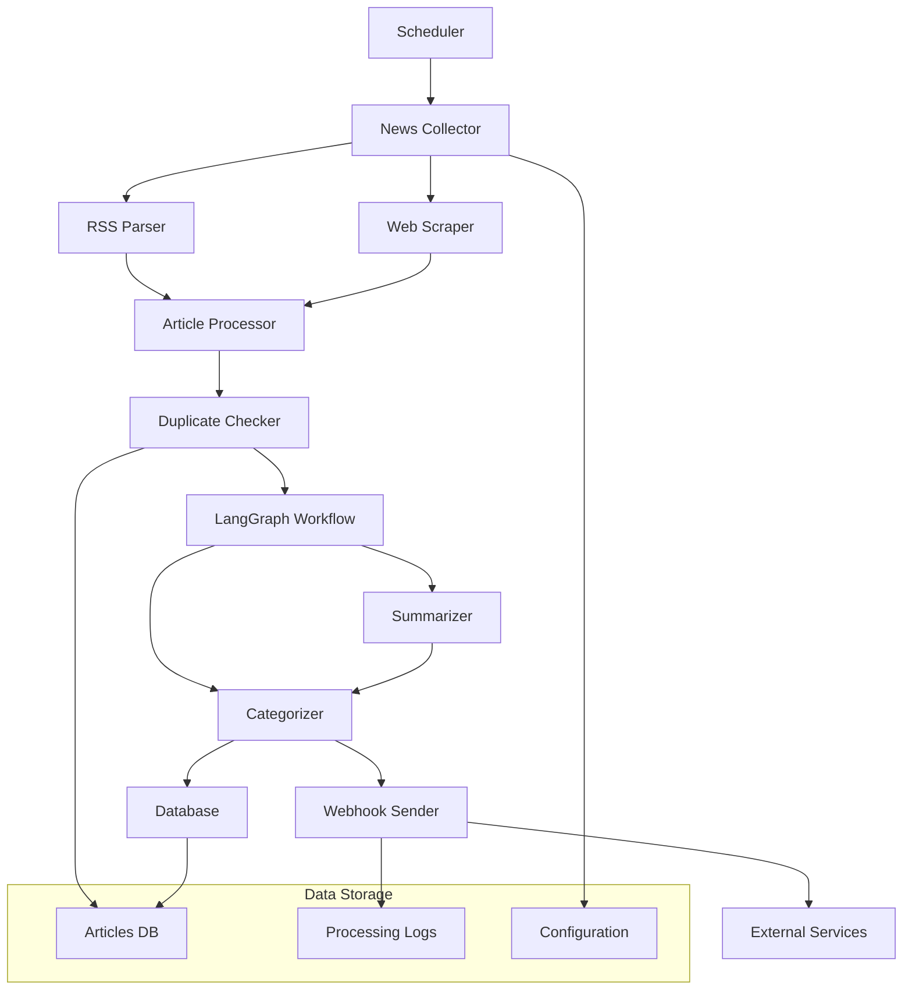

# Design Document

## Overview

ニュース要約・配信システムは、複数のニュースソース（RSSフィード、Webスクレイピング）から記事を収集し、LangChain/LangGraphを使用して要約・カテゴライズを行い、Webhookで配信するPythonベースのシステムです。

### 主要技術スタック
- **Python 3.12+**: メインプログラミング言語
- **feedparser**: RSSフィード解析
- **newspaper3k**: Webスクレイピング
- **LangChain**: AI処理フレームワーク
- **LangGraph**: ワークフロー状態管理
- **SQLite/PostgreSQL**: データベース（重複チェック用）
- **requests**: HTTP通信（Webhook送信）
- **schedule**: 定期実行管理
- **logging**: ログ管理

## Architecture

### システム構成図



### データフロー

1. **収集フェーズ**: Schedulerが定期的にNews Collectorを起動
2. **解析フェーズ**: RSS ParserとWeb Scraperが記事を取得
3. **重複チェック**: Duplicate Checkerがデータベースで既処理記事をチェック
4. **AI処理フェーズ**: LangGraphワークフローで要約→カテゴライズを実行
5. **配信フェーズ**: Webhook Senderが外部サービスに送信

## Components and Interfaces

### 1. News Collector (ニュース収集器)

**責任**: 設定されたニュースソースから記事情報を収集

```python
class NewsCollector:
    def collect_from_rss(self, rss_urls: List[str]) -> List[Article]
    def collect_from_web(self, web_urls: List[str]) -> List[Article]
    def get_configured_sources(self) -> Dict[str, List[str]]
```

### 2. Article Processor (記事処理器)

**責任**: 収集された記事の前処理と正規化

```python
class ArticleProcessor:
    def normalize_article(self, raw_article: Dict) -> Article
    def extract_content(self, article: Article) -> str
    def validate_article(self, article: Article) -> bool
```

### 3. Duplicate Checker (重複チェッカー)

**責任**: 処理済み記事の重複チェック

```python
class DuplicateChecker:
    def is_processed(self, article_url: str) -> bool
    def mark_as_processed(self, article_url: str, processed_at: datetime)
    def get_processing_history(self, days: int) -> List[ProcessingRecord]
```

### 4. LangGraph Workflow (AI処理ワークフロー)

**責任**: LangGraphを使用した要約・カテゴライズの状態管理

```python
class ArticleProcessingWorkflow:
    def create_workflow(self) -> StateGraph
    def summarize_node(self, state: ArticleState) -> ArticleState
    def categorize_node(self, state: ArticleState) -> ArticleState
    def process_article(self, article: Article) -> ProcessedArticle
```

### 5. Webhook Sender (Webhook送信器)

**責任**: 処理済み記事の外部サービス配信

```python
class WebhookSender:
    def send_to_webhook(self, processed_article: ProcessedArticle, webhook_url: str) -> bool
    def retry_failed_sends(self, max_retries: int = 3)
    def format_payload(self, article: ProcessedArticle) -> Dict
```

## Data Models

### Article (記事モデル)

```python
@dataclass
class Article:
    url: str
    title: str
    content: str
    published_at: Optional[datetime]
    source: str
    source_type: Literal["rss", "web"]
```

### ProcessedArticle (処理済み記事モデル)

```python
@dataclass
class ProcessedArticle:
    original_article: Article
    summary: str
    category: str
    confidence_score: float
    processed_at: datetime
    processing_duration: float
```

### ArticleState (LangGraph状態モデル)

```python
@dataclass
class ArticleState:
    article: Article
    summary: Optional[str] = None
    category: Optional[str] = None
    error: Optional[str] = None
    step: str = "start"
```

## Error Handling

### エラー分類と対応

1. **ネットワークエラー**
   - RSSフィード取得失敗
   - Webスクレイピング失敗
   - Webhook送信失敗
   - 対応: リトライ機能、エラーログ記録、処理継続

2. **AI処理エラー**
   - LangChain API呼び出し失敗
   - トークン制限超過
   - 対応: フォールバック処理、元記事保持、エラー通知

3. **データベースエラー**
   - 接続失敗
   - クエリエラー
   - 対応: 接続リトライ、トランザクション管理

4. **設定エラー**
   - 不正な設定ファイル
   - 必須パラメータ不足
   - 対応: バリデーション、デフォルト値設定

### エラー処理戦略

```python
class ErrorHandler:
    def handle_network_error(self, error: Exception, context: str)
    def handle_ai_processing_error(self, error: Exception, article: Article)
    def handle_database_error(self, error: Exception, operation: str)
    def should_retry(self, error: Exception, attempt_count: int) -> bool
```

## Testing Strategy

### テスト階層

1. **ユニットテスト**
   - 各コンポーネントの個別機能テスト
   - モック使用によるAPI呼び出しテスト
   - データモデルのバリデーションテスト

2. **統合テスト**
   - RSS解析とデータベース保存の統合テスト
   - LangGraphワークフローの状態遷移テスト
   - Webhook送信の統合テスト

3. **エンドツーエンドテスト**
   - 実際のRSSフィードを使用した全体フローテスト
   - エラー処理とリカバリのテスト
   - パフォーマンステスト

### テスト環境

```python
# テスト用設定
TEST_CONFIG = {
    "rss_feeds": ["https://example.com/test-feed.xml"],
    "web_urls": ["https://example.com/test-article"],
    "webhook_url": "https://webhook.site/test",
    "database_url": "sqlite:///:memory:",
    "ai_model": "gpt-3.5-turbo"  # テスト用軽量モデル
}
```

### モックとスタブ

- **RSS Feed Mock**: テスト用のRSSフィードデータ
- **AI API Mock**: LangChain/LangGraph API呼び出しのモック
- **Webhook Mock**: 外部サービス呼び出しのモック
- **Database Stub**: インメモリデータベースでの高速テスト