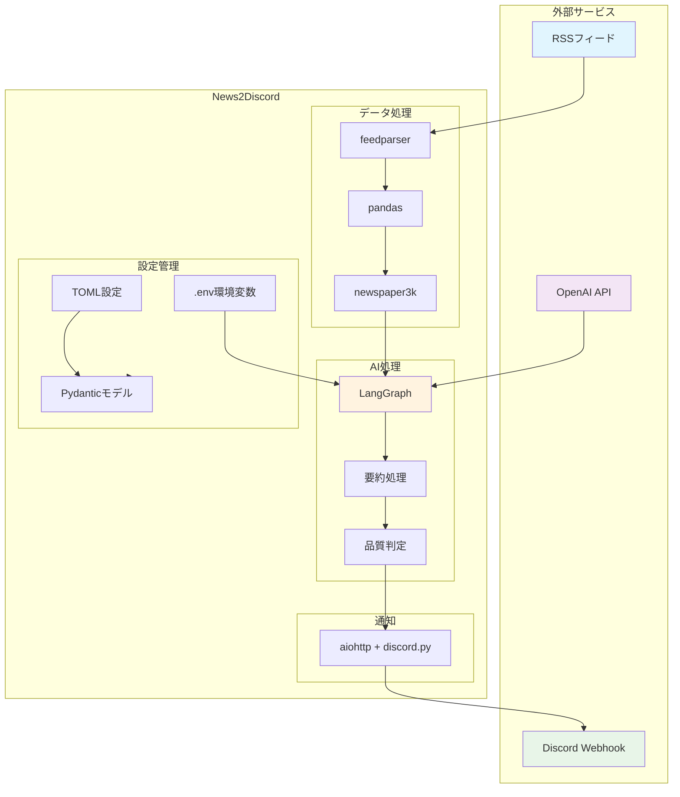
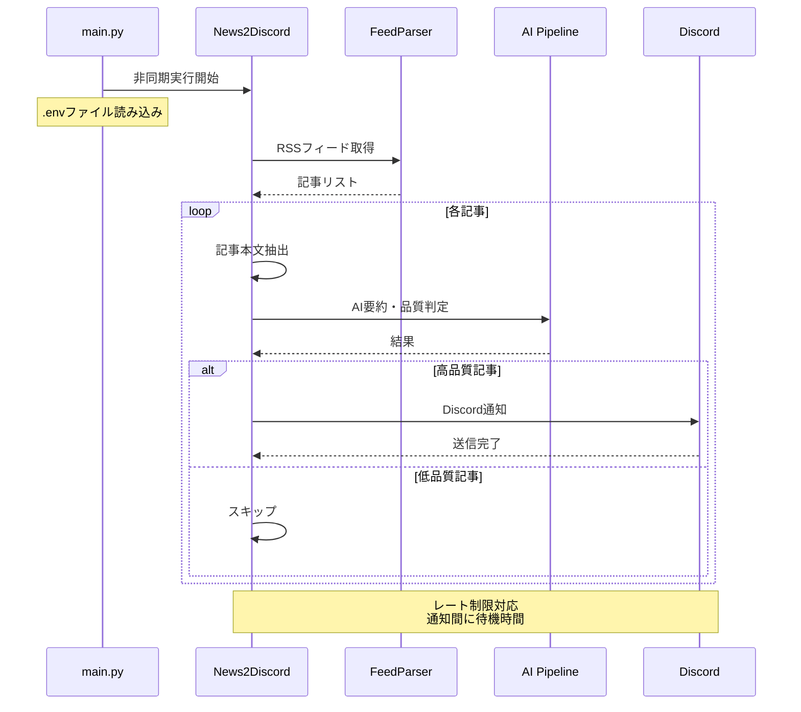
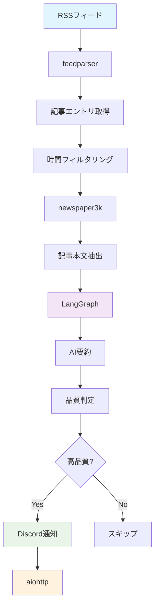

# News2Discord

RSSフィードから記事を取得し、AIで要約・品質判定を行ってDiscordに通知する非同期処理ツールです。

## 🚀 機能

- **RSSフィード処理**: 複数のRSSフィードから記事を自動取得
- **記事解析**: newspaper3kを使用した記事本文の抽出
- **AI要約**: LangChain + OpenAIによる記事の要約とキーワード抽出
- **品質判定**: AIによる記事品質の自動判定（高品質記事のみ通知）
- **Discord通知**: レート制限対応のDiscord Webhook通知
- **非同期処理**: 効率的な非同期処理による高速化
- **環境変数管理**: .envファイルによるAPIキー管理

## 🏗️ アーキテクチャ

### システム全体構成



### 非同期処理フロー



### データフロー



### 処理フロー詳細

1. **環境変数読み込み**: .envファイルからAPIキーを読み込み
2. **フィード取得**: 設定されたRSSフィードから記事を取得
3. **時間フィルタリング**: 指定時間（デフォルト1時間前）以降の記事を抽出
4. **記事解析**: 各記事のURLから本文、タイトル、画像を抽出
5. **AI処理**: LangGraphを使用した要約と品質判定のパイプライン
6. **通知送信**: 高品質と判定された記事のみDiscordに通知

## 📋 セットアップ

### 前提条件

- Python 3.12以上
- OpenAI API キー

### 1. 依存関係のインストール

```bash
# uvを使用（推奨）
uv sync
```

### 2. 環境変数の設定

#### 方法1: .envファイルを使用（推奨）

```bash
# 環境変数ファイルの準備
cp env.example .env

# .envファイルを編集してAPIキーを設定
# OPENAI_API_KEY=your-actual-api-key-here
```

#### 方法2: 環境変数を直接設定

```bash
# Linux/macOS
export OPENAI_API_KEY="your-api-key-here"

# Windows
set OPENAI_API_KEY=your-api-key-here
```

### 3. 設定ファイルの準備

```bash
cp config/example.config.toml config/config.toml
```

### 4. 設定ファイルの編集

`config/config.toml` を編集して以下を設定：

```toml
[ai.summarization]
model = "gpt-5"  # 使用するOpenAIモデル
temperature = 0.1
system_prompt = "記事の要約プロンプト"

[ai.judge]
model = "gpt-5-mini"
temperature = 0.1
system_prompt = "品質判定プロンプト"

[notifications.discord]
webhook_url = "https://discord.com/api/webhooks/your-webhook-url"
rate_limit_delay = 0.4  # 通知間の待機時間（秒）
max_retries = 3  # 最大リトライ回数

[[feeds]]
name = "TechCrunch"
url = "https://techcrunch.com/feed/"
```

## 🚀 使用方法

### 基本実行

```bash
# 1時間前からの記事を処理
uv run main.py

# または
python main.py
```

### カスタムオフセット

```bash
# 3時間前からの記事を処理
uv run main.py --offset=3
```

### cronでの定期実行

Linuxでcronを使用して定期実行する場合：

```bash
# crontabを編集
crontab -e

# 毎時0分に実行（1時間前からの記事を処理）
0 * * * * cd /path/to/news2discord && /usr/local/bin/uv run main.py

# 30分ごとに実行（30分前からの記事を処理）
*/30 * * * * cd /path/to/news2discord && /usr/local/bin/uv run main.py --offset=0.5

# 毎日午前9時に実行（24時間前からの記事を処理）
0 9 * * * cd /path/to/news2discord && /usr/local/bin/uv run main.py --offset=24
```

**注意**: cronでは環境変数が読み込まれないため、`.env`ファイルを使用することを推奨します。

### コマンドライン引数

- `--offset`: 処理対象の時間範囲（時間単位、デフォルト: 1）

## ⚙️ 設定詳細

### AI設定

#### 要約設定 (`[ai.summarization]`)
- `model`: 使用するOpenAIモデル（例: "gpt-5"）
- `temperature`: 生成のランダム性（0.0-1.0）
- `system_prompt`: 要約用のシステムプロンプト

#### 品質判定設定 (`[ai.judge]`)
- `model`: 使用するOpenAIモデル（例： "gpt-5-mini"）
- `temperature`: 生成のランダム性
- `system_prompt`: 品質判定用のシステムプロンプト

### Discord設定 (`[notifications.discord]`)
- `webhook_url`: Discord Webhook URL
- `rate_limit_delay`: 通知間の待機時間（秒）
- `max_retries`: 送信失敗時の最大リトライ回数

### フィード設定 (`[[feeds]]`)
- `name`: フィードの表示名
- `url`: RSSフィードのURL

### 環境変数設定 (`.env`)
- `OPENAI_API_KEY`: OpenAI APIキー（必須）

## 🔧 開発

### 開発環境のセットアップ

```bash
# 開発用依存関係のインストール
uv sync --group dev

# コードフォーマット
uv run ruff format .

# リント
uv run ruff check .
```

### プロジェクト構造

```
news2discord/
├── main.py                 # エントリーポイント
├── env.example             # 環境変数例
├── .env                    # 環境変数（.gitignore）
├── news2discord/
│   ├── __init__.py        # メインクラス
│   ├── models/            # データモデル
│   │   ├── config.py      # 設定モデル
│   │   ├── record.py      # 記事データモデル
│   │   ├── flow.py        # AI処理モデル
│   │   └── notification.py # 通知モデル
│   ├── flow/              # AI処理パイプライン
│   │   ├── __init__.py    # LangGraph設定
│   │   ├── summarize.py   # 要約処理
│   │   └── judge.py       # 品質判定
│   └── notification/      # 通知機能
│       └── discord.py     # Discord通知
└── config/
    ├── config.toml        # 設定ファイル
    └── example.config.toml # 設定例
```

## 🐛 トラブルシューティング

### よくある問題

1. **設定ファイルが見つからない**
   ```
   設定ファイルが見つかりません: config/config.toml
   ```
   → `config/example.config.toml` を `config/config.toml` にコピーしてください

2. **Discord Webhook URLが設定されていません**
   → 設定ファイルの `webhook_url` を正しく設定してください

3. **OpenAI API エラー**
   ```
   警告: OPENAI_API_KEYが設定されていません
   ```
   → `.env`ファイルまたは環境変数で `OPENAI_API_KEY` を設定してください
   ```bash
   # .envファイルを使用（推奨）
   cp env.example .env
   # .envファイルを編集してAPIキーを設定
   ```

4. **cronで環境変数が読み込まれない**
   → `.env`ファイルを使用してください。cronでは環境変数が継承されません。

5. **レート制限エラー**
   → `rate_limit_delay` の値を増やしてレート制限を回避してください

## 📝 ログ

アプリケーションは以下のログレベルで情報を出力します：

- `INFO`: 処理の進行状況
- `WARNING`: 記事取得失敗などの警告
- `ERROR`: エラー情報

ログフォーマット: `%(asctime)s - %(name)s - %(levelname)s - %(message)s`

### 起動時のログ例

```
環境変数を読み込みました: /path/to/.env
設定ファイルを読み込みました: /path/to/config/config.toml
Processing feeds: 100%|██████████| 3/3 [00:05<00:00]
Processing articles: 100%|██████████| 15/15 [01:23<00:00]
```

## 🤝 貢献

1. このリポジトリをフォーク
2. 機能ブランチを作成 (`git checkout -b feature/amazing-feature`)
3. 変更をコミット (`git commit -m 'Add amazing feature'`)
4. ブランチにプッシュ (`git push origin feature/amazing-feature`)
5. プルリクエストを作成

## 📄 ライセンス

このプロジェクトはMITライセンスの下で公開されています。